# Final Design 
## Introduction 

The final robot design built upon everything achieved in the previous labs and milestones while adjusting some aspects of the robot for robustness in line following, wall detection, IR detection, radio transmission from the robot to base station, and maze traversal. Threshold values for lines and walls were adjusted to ensure the robot would not venture off the gridlines or crash into walls. Another battery was added to ensure enough current would flow through the servos, speeding up the robot. Additional hardware was used to ensure IR would work without some software tools since memory was limited on the Arduino. Finally, the search algorithm for the maze was modified so that less time would be spent on turns, which is more time consuming than moving forward.

## Line following
For the final robot design, we had 3 line sensors in the front of the robot, all perpendicular to the line they are following. 
We have determined that the most effective way to place the sensors was to position the middle sensor on the line being followed with the other two straddling the line to detect intersections or if the robot is straying from the line.
The following image shows the final sensor placement:

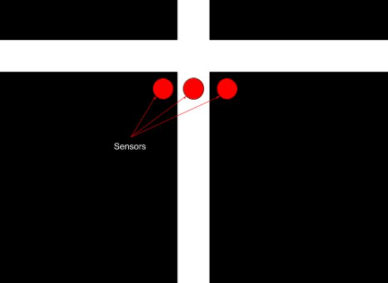{:height="480px" width="640px"}

To better detect and adjust the position of the robot, we changed the line sensor threshold value to 945. Less is considered a white line and more is considered a black line. By comparing values from the left, middle, and right sensors we determined where the robot was in relation to the white line. 

For instance, if the middle sensor detects the color white while the left and right sensors do not detect it, then this implies that the robot is centered on the white line and should continue going straight forward with both wheels turning at the same speed. If the right and middle sensors are reading the the color white while the left sensor does not, then this implies that the robot is too far to the left and needs to move towards the right to become centered again. To make the robot shift rightwards, we increased the speed of the left wheel compared to that of the right wheel. 

The same logic follows if the robot is too far to the right and needs to move more towards the left to become centered with the line again. To make the robot shift leftwards, we increased the speed of the right wheel compared to that of the left wheel. Whenever the robot passed an intersection, all three sensors would detect the color white.

## Wall sensing
We have three wall sensors on the front, left, and right. They are powered with 5V from the 5V pin of the arduino. They send their signal to a mux. Upon detecting a intersection, we call the function wall_detect() on a specified direction. In each function, select bits (digital pins 6 and 7) are set to receive the analog values from the wall sensor pointing the correct direction.

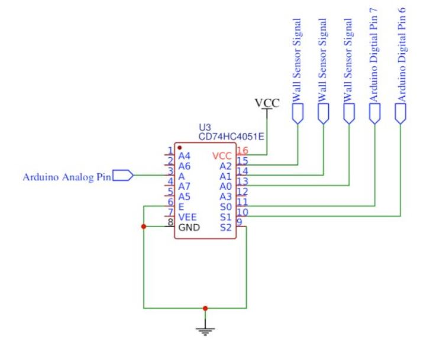{:height="480px" width="640px"}

With this setup we are able to read the 3 analog values from the wall sensors into one pin. Unfortunately, our wall sensors are unreliable. When reading from our wall sensors, there are many spike and notches. This made any fixed threshold extremely unreliable. To solve this problem, we average 100 values from a wall sensor before comparing to a threshold. This is not a rolling average because we don’t want to use old values. Each intersection should average completely new values. Below is example code for the left wall:

```cpp
bool left_wall_detect(){
  //setting mux select signals
  // digitalWrite(S2,LOW);
  rightWallSensorDir = (dir+1)%4;
  leftWallSensorDir = (dir+3)%4;
 
  l_wall_sensor = 0;
  digitalWrite(S1, LOW);
  digitalWrite(S0, LOW);
  delay(80);
  l_wall_sensor = average();
  //Serial.println(l_wall_sensor);
  //Serial.println("left wall sensor: "+String(l_wall_sensor));
  if(l_wall_sensor > l_wall_threshold){
	//Serial.println("Left wall detected");
	wallsToRadio(leftWallSensorDir);
	return true;
  }
  return false;
} 
```

## Microphone
To read analog values form the microphone we made an amplifier with a DC bias of 2.5V. The below inverting amplifier has a gain of Av=Zf/ZIN=33k/330=100. 

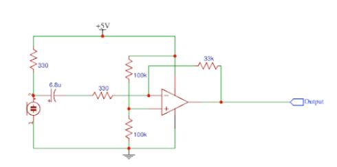{:height="480px" width="640px"}
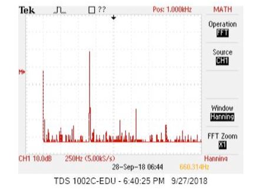{:height="480px" width="640px"}

This amplifier gave a very strong peak at 660Hz. The next step is to have the arduino realize it is receiving a 660 Hz tone. To do this we used the FFT library.  A 660 Hz tone is found in the 19th bin so we only need to check there. We wrote the following code to analyze the signal:
```cpp
void mic_read(){
  for (int i = 0 ; i < 512 ; i += 2) { // save 256 samples
  	fft_input[i] = analogRead(A4); // put real data into even bins
  	fft_input[i+1] = 0; // set odd bins to 0
  }
  fft_window(); // window the data for better frequency response
  fft_reorder(); // reorder the data before doing the fft
  fft_run(); // process the data in the fft
  fft_mag_log(); // take the output of the fft
  mic = fft_log_out[19];//set the sampled value to mic
}
```

We implement this function in a while loop in our setup. Once the mic value passes a threshold, we exit the while loop and can start running the robot.

```cpp
boolean starting = false;//we have not started yet
while(starting==false){//loop while we have not started
	pause();
	mic_read();//update mic val
	if(mic>mic_threshold){//if threshold is met
    	starting=true;//condition to leave while loop
  	}
  }
```

## IR
On the final robot design, we decided to not use the provided FFT library to read the 6kHz signal from the IR hat as we ran into memory issues on the Arduino as well as issues with timer interrupts. Instead we decided to use the analog output of our circuit as an input to the Arduino directly. 

We started with a simple phototransistor circuit as shown below:
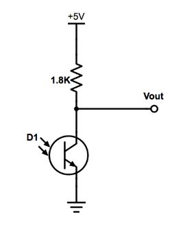{:height="480px" width="640px"}

We then added an inverting amplifier circuit and an active low pass filter shown below: 
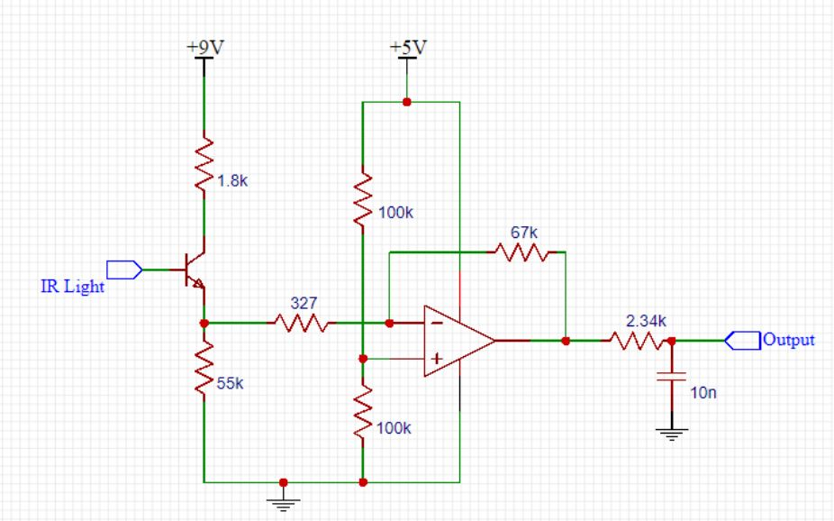{:height="480px" width="640px"}

The cutoff frequency of the filter is given by: Fcutoff = 1/(2pi*R2*C2) = 6.6kHz

The output of this circuit was fed directly into an analog input pin on the Arduino. Since our IR hat was connected in series with a resistor, our circuit would output a voltage that is less than 5V as soon as the 6KHz signal was detected, and not when an 18kHz signal from the decoy was detected because of the filter, which was enough for the purposes of detecting other robots and not decoys. 

We then ran the analogRead() function and set a threshold on when a robot was detected. 
In the case a robot was detected, we just pause the robot. The following function was used to stop the robot from moving: 
```cpp
void ir_detect(){
  double ir_val=analogRead(A0);
  if(ir_val<720){
	pause();
    }
  }
```

## GUI/ Radio
At intersections, the robot would transmit encoded information about the maze to the GUI through the radios on the robot and on the base station connected to a laptop. The radios are directly attached to the new Arduino boards we acquired for the robot. Since the old Arduino boards did not supply enough current to the radios, a power supply was needed. The new Arduinos are able to supply sufficient current to eliminate the use of the power supply. The radio on the final robot is circled in red on the image below.

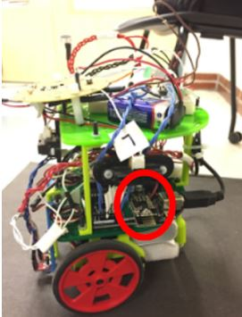{:height="480px" width="640px"}


The bit masking was also updated to more efficiently transmit information. Unfortunately, we were not able to implement our camera and FPGA on our robot due to space restraints on our robot. The existing circuit boards, IR hat, batteries, and Arduino consumed almost all the space we had available on the robot. Because of this, the robot transmitted one less byte per intersection since treasure information is no longer needed. The information sent over is the direction the robot is moving, the position of the walls, and the presence of other robots. The direction the robot is heading is automatically updated by the turning commands. For instance, if the robot is heading north and the right turn command is called, then the direction variable is automatically updated from north to east. The walls are updated in a similar fashion. The left wall direction is always 90 degrees to the left of the direction the robot is moving and the right wall direction is always 90 degrees to the right of the direction the robot is moving. These are updated by the turning commands as well. Thus, when the wall detection methods are called, the walls are in the correct cardinal direction. The new bit masking becomes:

Bits [1 0] are direction:
2'b00 is north
2'b01 is east
2'b10 is south
2'b11 is west

Bits [5 4 3 2] are wall presence for [N E S W]
If bit 5 is 1, then there is a north wall
If bit 4 is 1, then there is a east wall
If bit 3 is 1, ,then there is a south wall
If bit 2 is 1, then there is a west wall

Bit [6] is robot presence
If bit 6 is 1, then there is a robot present

The following code demonstrates how the maze information was decoded at the base station. The information gathered allowed the base station to update the coordinates of the robot.

```cpp
char msg[32]="";
   radio.read(msg, sizeof(msg));
   guiMsg = "";   

   //maze info has direction, walls, robot               
   byte mazeInfo = msg[0];  
   //get direction data from robot and update position
   byte dir = mazeInfo;
   dir &= 0b00000011;
   //get wall data from robot
   byte walls = mazeInfo;
   walls &= 0b00111100;
   updateWalls(walls);

   //get robot presence
   byte roboPresence = mazeInfo;
   roboPresence&= 0b01000000;
   updateRoboPresence(roboPresence);

   //update the guiMsg
   guiMsg = String(row)+","+String(col) + guiMsg;            
   Serial.println(guiMsg); 
  updatePosition(dir);
```

To improve the reliability of data transmission from the robot to the base station, the robot would continue to send the relevant data until the base station had received it. This further ensures the reliability of the information presented on the GUI.


## Maze Exploration
The algorithm used to explore the maze is a greedy depth first search algorithm. The algorithm prioritizes continuing to move forward rather than turning since moving straight consumes less time than turning does. The algorithm then prioritizes to go in the directions of south, then east, then north, then west. These directions are all absolute directions. This means that the four cardinal directions are predefined and constant/ never changing. The robot’s orientation can change during the traversal of the maze. The robot keeps track of the nodes visited through a 2D 9x9 boolean matrix. Each matrix element represents a node on the maze and flags whether the node has been visited. 

At each intersection, the robot checks for walls so that it knows what directions in cannot move in. The robot also checks to see if there are any unvisited neighboring nodes. If there are, the robot turns so that it will head in the correct direction. This is achieved quickly through the following code.
```cpp
void turnToDir(int cardinal){
  if(dir==cardinal){
    //do nothing  
    //return;
    forward();
  }
  else if((cardinal-dir+4)%4 == 1){
    right_turn();
  }
  else if(abs(dir-cardinal)==2){
    uturn();  
  }
  else{
    left_turn();
  }
}
```

This direction is pushed onto the stack for backtracking purposes. If the robot is surrounded by nodes it has already visited, then the stack is popped and the robot traverses in the direction opposite direction of the direction popped. Finally, the position of the robot is updated so that we know the location of the robot on the 9x9 maze. For instance, if the robot heads north, the the row index that the robot is at is modified to reflect the change in position.

```cpp
void updatePosition() {
    if (dir == north) {
      row=row-1;
      visited[row+1][col] = 1;
    }
    else if (dir == south) {
      row=row+1;
      visited[row-1][col] = 1;
    }
    else if (dir == east) {
      col=col+1;
      visited[row][col-1] = 1;
    }
    else if (dir == west) {
      col=col-1;
      visited[row][col+1] = 1;
    }
}
```


## FPGA and Camera
Despite having the camera and FPGA working off of the robot, we chose not to implement it for the final competition. We made this decision based on the limited space we had available on the robot and the limited time we had to tune the FPGA thresholds to what the camera would see while on the robot. Instead, we focused on cleaning up our line following, error correction, and wall detection. The way our treasure detection worked off of the robot was to first count the number of red and blue pixels in the camera image. If the number of red or blue pixels exceeded a threshold, then a treasure of that color was said to be present. After the color of a pixel was determined, its location was marked. We broke the screen up into sections in order to evaluate shapes. 

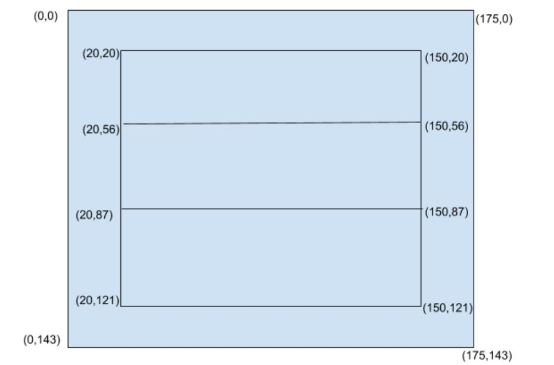{:height="480px" width="640px"}

We only marked the locations of pixels in the three horizontal bars in the middle of the screen. If the top bar had less pixels of a certain color than the middle bar, which in turn had less than the bottom bar, we determined the treasure to be a triangle. If the middle bar had the most pixels, the treasure was a diamond. Otherwise, it was a square. If neither color met the pixel threshold, we said no treasure was present. To make our image processing more consistent, we used a pixel threshold (SHAPE) when comparing the bars. If the middle bar was greater than the other two by only one pixel, then the image is most likely an off center square, but our logic would mark it as a diamond. To avoid this, a threshold of 100 pixels was added to the bar that should have less pixels. This way, the middle bar must have at least 100 more pixels of a color than the top and bottom bars.

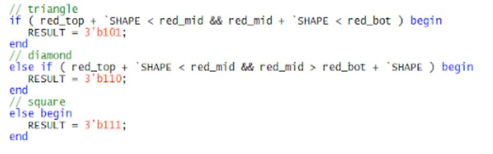{:height="480px" width="640px"}

Even with this correction, we noticed we still had some issues with proper detection since the FPGA was not always right the first time, but was right a majority of the time. To deal with this, we took 30 results from the FPGA and averaged them. This was done by having a counter on the Arduino set to 0 initially. We would add a value to it depending on the shape and color detected, and then average this value.

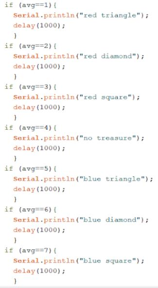{:height="640px" width="480px"}

Of course, the more values we take, the longer this process will take. We found 30 values to be reasonable, but this would need further testing when on the robot.

## Future Improvements, Budget, and Competition
### Improvements
If we had the chance to improve our robot even further, there are a few things we would do:

~Use PCBs or perf board instead of breadboards to make the robot look neater and lighter. This would also lead to the robot moving faster and therefore map more of the maze in a shorter time. 
~Adjust the turns on the robot to make them faster and avoid too many corrections after each turn. 
~Added the camera for treasure detection. The camera was working outside of the robot but due to lack of space on the robot we couldn't add it in and make adjustments to shape and color detection thresholds.
~Instead of stopping the robot when the 6KHz IR signal was detected, we could instead perform a U-turn, after which we update our direction
and position for the DFS algorithm. This would have helped us avoid stopping completely after another robot also paused on detecting our IR signal.

### Budget
The overall cost of the robot we built is summarized below
(3) line sensors: $9
(3) IR distance sensors (wall sensors): $21
(1) Camera: $14
(2) Parallax servos: $26
(1) Arduino Uno: $16
Total cost: $86

### Final Robot in Competition
Our robot finished in the top four during the final competition!
Below is a video of one of our runs.
<iframe width="640" height="480" src="https://www.youtube.com/embed/4dIkRRFoLJo" frameborder="0" allowfullscreen></iframe>

Below are various shots of our final robot design


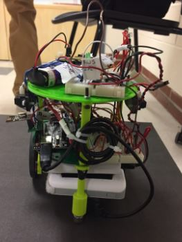{:height="640px" width="480px"}
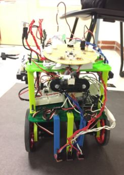{:height="640px" width="480px"}
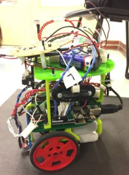{:height="640px" width="480px"}
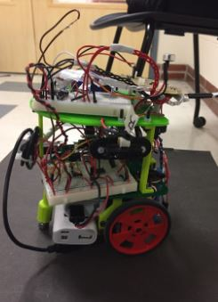{:height="640px" width="480px"}
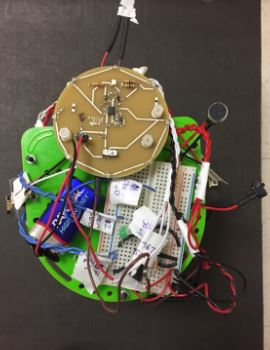{:height="640px" width="480px"}


