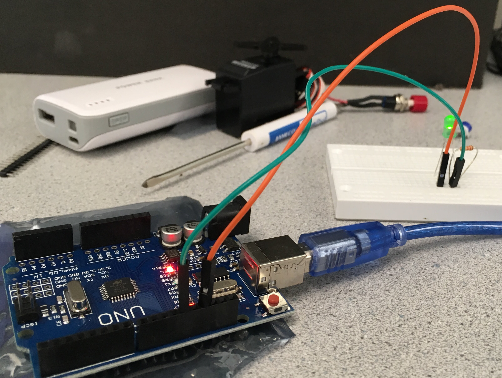
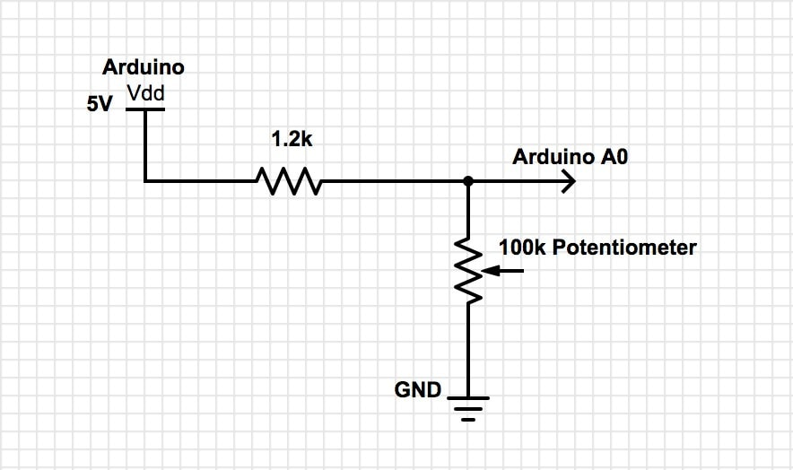
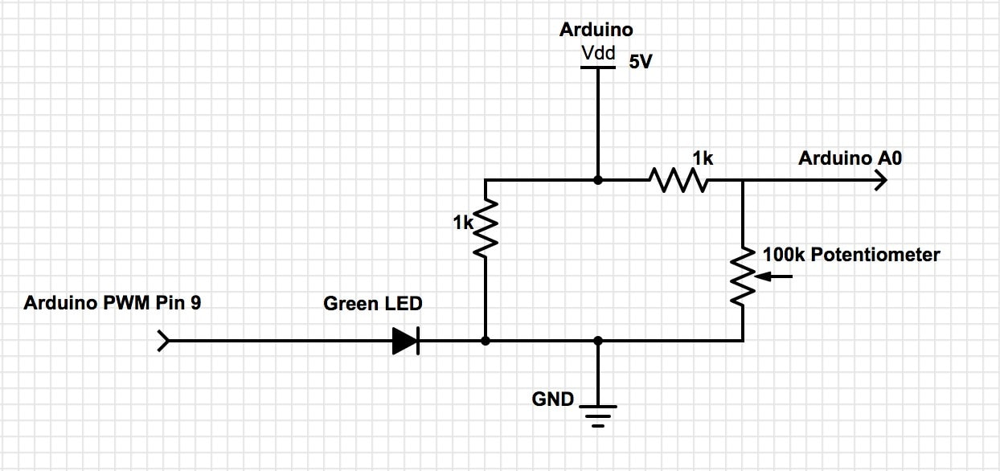
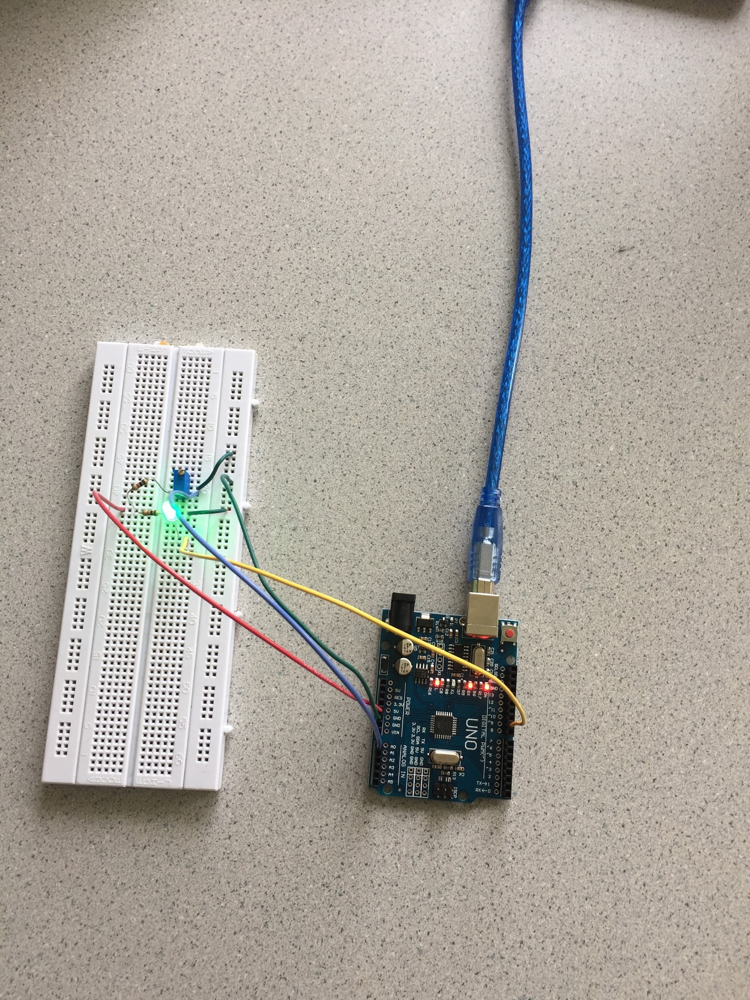
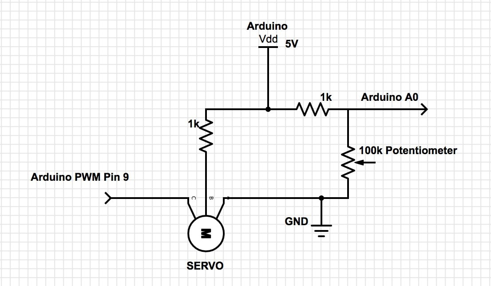
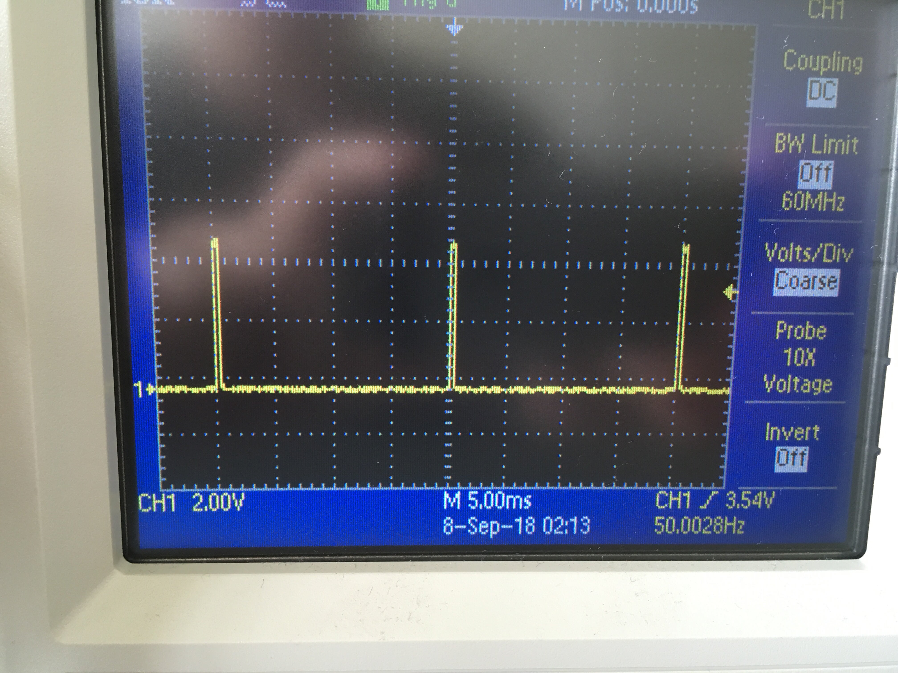
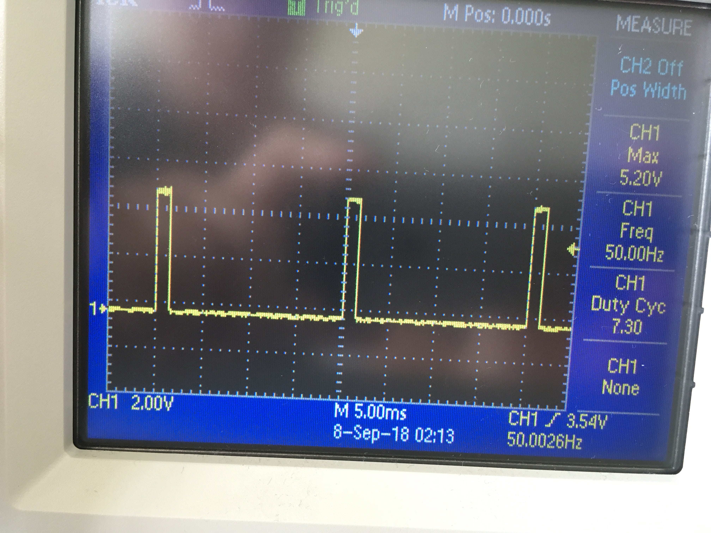
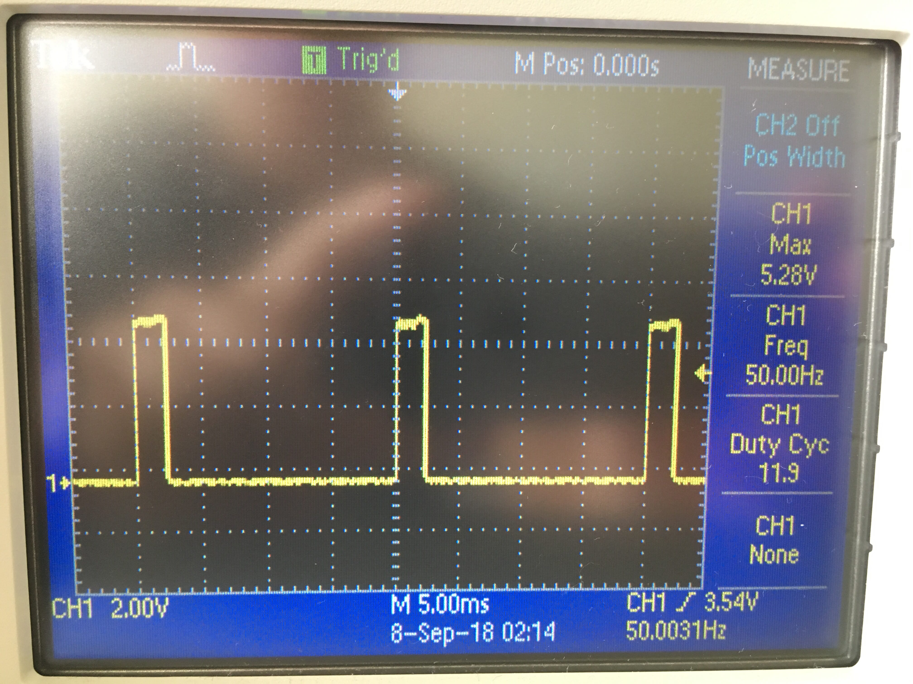

# Lab 1: Microcontroller

### Objectives
* Learn how to use the various functionalities of the Arduino Uno and the Arduino IDE.
* Construct a simple functional Arduino program using multiple external components and the Arduino Uno.
* Assemble our robot and have it perform a simple autonomous task

### Subteams
**Team 1**: Manhal, Grant

**Team 2**: Jason, Beau

## Blinking an internal LED
After downloading the Arduino IDE from [this link](https://www.arduino.cc/en/Main/Software), we used the Blink example that can be accessed from File>>Examples>>01.Basics>>Blink to successfully blink the internal LED.
<iframe width="640" height="480" src="https://www.youtube.com/embed/14P1Wfs-y9U" frameborder="0" allowfullscreen></iframe>

## Blinking an external LED
We connected the ouptput pin 12 of the Arduino with the LED, in series with a 1.2 kΩ resistor. The longer leg of the LED is the positive lead (anode) and should be connected with the resistor (and thereby pin 12). The shorter, negative side should connect to GND of the arduino.
The setup is shown in the picture below:
  
We then modified the existing Blink code to blink an external LED by setting the output pin to  the external pin (pin 12) rather than the built-in LED (defined as LED_BUILTIN) in setup() as follows: 
```cpp
int pinnumber=12;
void setup() {
//used to initialize digital output pin as pin 12
pinMode(pinnumber, OUTPUT);
}
```
We then write to pin 12 as follows:
```cpp
void loop() {
  digitalWrite(pinnumber, HIGH);   // turn the LED on (HIGH is the voltage level)
}
```

## Reading the value of a potentiometer via the serial port
The following diagram shows the connection of the potentiometer to the Arduino.
  
To read the analog value from the potentiometer, we first had to initialize the serial communication over USB by including the following code in setup(): 
```cpp
Serial.begin(9600); // sets the data rate in bits per second (baud) for serial communication
```
In our loop(), we read the sensor value from pin 0 on the Arduino and and print it on the serial monitor using the following code:
```cpp  
float value=analogRead(A0); //read the value from the potentiometer and assign it to var value
Serial.println(value); // print the value to serial port in ASCII text. 
```
We also include a delay in our loop to print the value every .5 seconds by adding 
```cpp   
delay(500); //delay the loop by 500ms
```
Uploading and running the sketch on the Arduino and printing the analog values on the serial monitor worked as expected. Here is a video of the setup and the corresponding analog values:
<iframe width="640" height="480" src="https://www.youtube.com/embed/zwIhWxZzoE4" frameborder="0" allowfullscreen></iframe>

## Map the value of the potentiometer to the LED
By connecting the LED to a PWM (Pulse Width Modulation) enabled pin (pin 9) on the Arduino we were able to map the potentiometer value to the LED. The following diagram shows the modified setup: 
 
To map the potentiometer value to the LED, we first scaled the sensor value from 0-1014 to 0-255 since the maximum duty cycle (the pin output is always set to high) for 255.
We used the following function:
```cpp
int input=map(value, 0, 1014, 0, 255);
```
We then wrote the variable input to the PWM pin:
```cpp
analogWrite(9, input);
```
The following is the implemented circuit from the schematic.

As we rotated the potentiometer, the LED changed brightness as shown in the following video:   
<iframe width="640" height="480" src="https://www.youtube.com/embed/1LCnNCJd0IA" frameborder="0" allowfullscreen></iframe>

## Map the value of the potentiometer to the servo
The Parallax Continuous Rotation Servos can rotate continuously over 360°. They take in PWM values between 0 and 180. If the value input is 90, the servo stops moving. At a value of 180, the servo is moving full speed in one direction, and at a value of 0 the servo is moving full speed in the opposite direction. Mapping the analog potentiometer values to the servo was done using a setup similar to the previous: 

We first scaled 0-180 to the Servo PWM range of 0-180 using the map function:
```cpp
int input=map(value, 0, 1014, 0, 255);
```
Next, we wrote that value to the servo through pin 9 and added a 20ms delay to make sure the reading was correctly received:
```cpp
myservo.write(input);   // adjusts the servo speed and direction based on the potentiometer value
delay(20);              // delay to ensure value is received by the servo
```
Below is a video of the servo’s response to a change in potentiometer values:
<iframe width="640" height="480" src="https://www.youtube.com/embed/0qEZ_O7TYYA" frameborder="0" allowfullscreen></iframe>

The duty cycle of the square wave corresponding to the PWM output is given by:
PWM (0-180) | Waveform
------------ | -------------
0 | 
90 | 
180 | 


