# Lab 2: Analog Circuitry and FFT

## Goal/ Objective

The purpose of this lab is to add sensors to our robot so that it can detect sound waves and infrared waves. A microphone circuit is added to detect a 660Hz whistle blow, signifying the start of the maze mapping. Another circuit is added to detect infrared (IR) waves emitted from other robots at around 6kHz. This circuit also differentiates between real robots emitting 6kHz as well as decoy robots emitting 18kHz.

## Prelab

To perform Fast Fourier Transform (FFT) analysis, we used Open Music Labs Arduino FFT library. The library uses the Arduino's Analog to Digital Converter (ADC) as opposed to the Arduino's analogRead function. The analogRead function samples at a frequency that is adequate for the 660Hz sound wave, but its sampling frequency is not high enough for the 6kHz infrared (IR) waves. Thus, the ADC is needed for FFT analysis of IR signals. Filters will also need to be added so that ambient noise and light from people and the environment do not interfere with these FFT readings. 

To ensure that the FFT library provided was functioning correctly, we performed FFT analysis on signals generated by a function generator at 660Hz, 2kHz, and 20kHz. We expected these to have peaks at different bins. The FFT analysis is shown below:


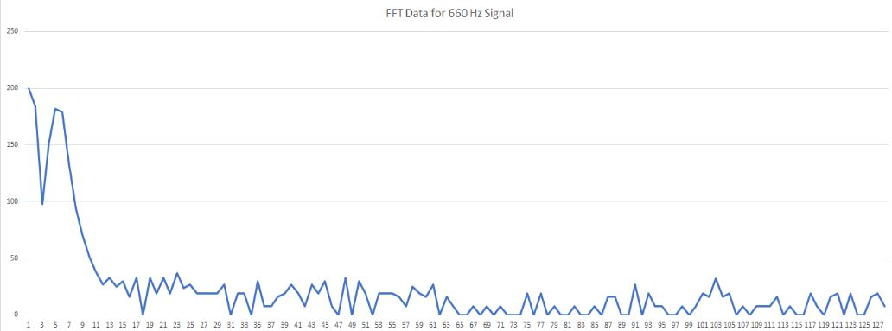{:height="400px" width="700px"}

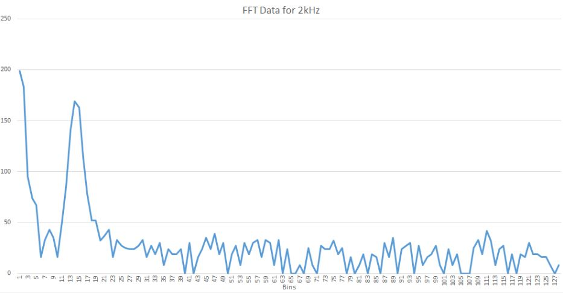{:height="400px" width="700px"}

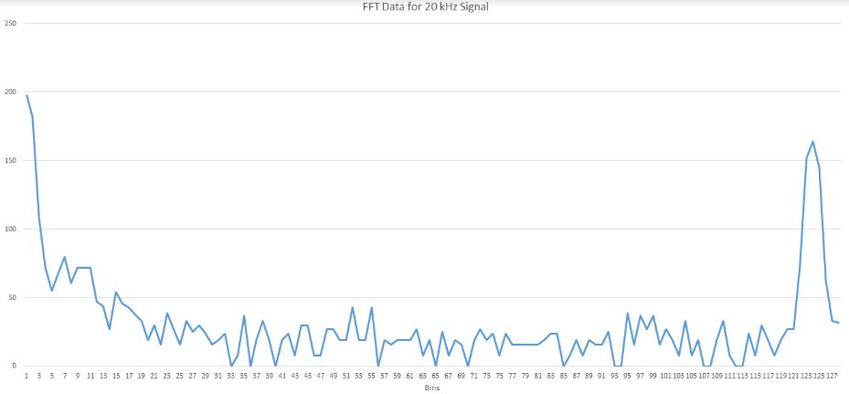{:height="400px" width="700px"}

## Acoustic Team

From the prelab we determined that AnalogRead() is sufficient to sample the 660Hz signal. From Arduino info page (https://playground.arduino.cc/Main/ShowInfo) we discovered that AnalogRead takes 111.987µs which gives a sampling frequency fs=1/(111.987e-6)=~8930Hz. This sampling frequency is enough for to detect the 660Hz signal since 8930>660*2>Nyquist frequency. 
We then modified the fft_adc example code from the FFT library as follows: 
'''cpp
void setup() {
  Serial.begin(115200); // use the serial port
  pinMode(LED_BUILTIN, OUTPUT);
}
int j=0;
void loop() {
    for (int i = 0 ; i < 512 ; i += 2) { // save 256 samples
      fft_input[i] = analogRead(A0); // put real data into even bins
      fft_input[i+1] = 0; // set odd bins to 0
    }
    fft_window(); // window the data for better frequency response
    fft_reorder(); // reorder the data before doing the fft
    fft_run(); // process the data in the fft
    fft_mag_lin(); // take the output of the fft
    Serial.println("Starting");
    for (byte i=0; i<FFT_N/2;i++){
      String str = "Bin Number ";
      String str2 = str + i +": ";
      Serial.println(str2);  
      Serial.println(fft_lin_out[i]);
      if(fft_lin_out[19]>=15){
        digitalWrite(LED_BUILTIN, HIGH);
        }
      else{digitalWrite(LED_BUILTIN, LOW);}
      }
  }
'''
To make sure that our code worked as expected, we blink the Arduino built-in LED whenever the 660Hz signal is detected. 

Since our sampling frequency was 8930 Hz and the number of samples was 256, each bin would have a size of approximately 8930/256=~35Hz. Therefore we expect the 18th bin to have the highest magnitude since 18*35=630Hz (the 18th bin would have frequencies in the range 630-665 Hz). However we determined that the bin that has the highest magnitude was bin 19 as shown below: 


### FFT Analysis

To perform Fast Fourier Transform (FFT) analysis, we needed to read in an analog signal through the Arduino. We cannot use the Arduino's analogRead() function that the microphone team used. The sampling rate for analogRead() is around 9kHz. However, this is not sufficiently fast enough for IR since we need to detect 6kHz signals, which requires a sampling rate of at least 12kHz by Nyquist’s sampling theorem. 

We used the fft_adc_serial script from the FFT (Fast Fourier Transform) library provided by Open Music Labs. We took advantage of the Analog to Digital Converter in free running mode for a sampling rate of around 40kHz to satisfy Nyquist’s theorem. The provided script collects 256 samples every time the FFT is run. Therefore the FFT bins have an approximate size of 40000/256 which is around 156.25Hz. Thus, the 6kHz signal is expected to be found in bin 38. When we ran the script provided, we found that the peak bin for the 6kHz signal was actually found in bin 43. 

### IR Circuit
We started with a simple phototransistor circuit as shown below:

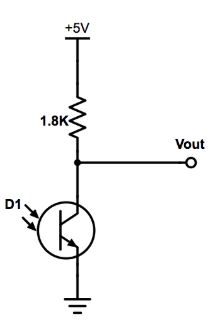{:height="320px" width="240px"}

We then placed the IR hat near the phototransistor and measured the output using the oscilloscope. It became clear that we would need a form of amplification because the IR hat needed to be within a few centimeters of the phototransistor in order to get any kind of usable or readable output. 


It also became evident that some type of filtering would need to be implemented. There were several frequencies that were not 6kHz that had large counts in their bins. These frequencies are most likely harmonics of the 6kHz signal. The unfiltered FFT for the IR signal is shown below:

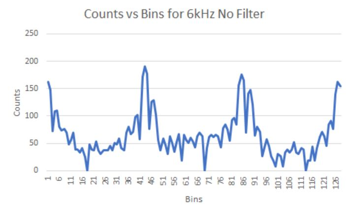{:height="480px" width="640px"}


To fix the gain and frequency issues, we then focused on implementing the following biased, inverting amplifier circuit. The circuit schematic is shown below:

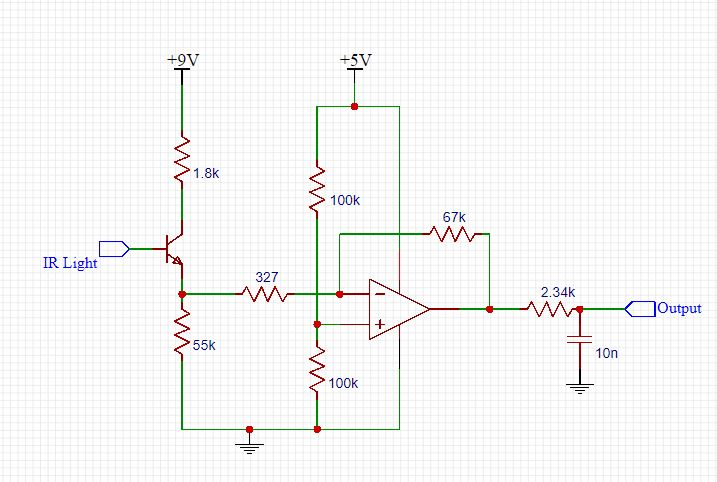{:height="480px" width="640px"}


The physical implemented circuit is shown below:

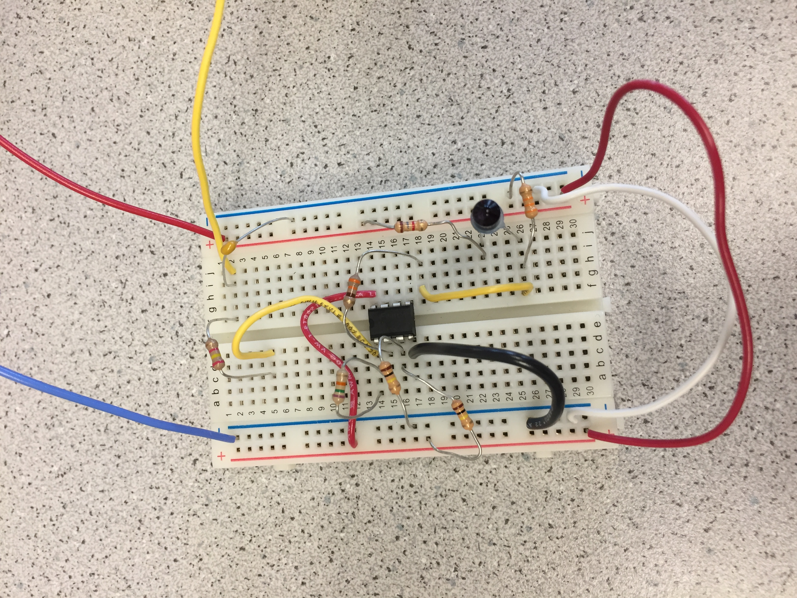{:height="480px" width="640px"}

We started off by testing the amplifier circuit with the function generator, generating a 6 kHz signal with 1 Vpp. We had various issues with the circuit and, in the end, discovered that for some reason our amplifier had a turn-on voltage of almost 1.5 Vpp. In order to counteract this strange phenomenon, we added a large resistor in series with the phototransistor in order to have more voltage into the inverting terminal of the amplifier. 

We also think that the reason this resistor is needed is because of the DC voltage bias we have applied to the non-inverting terminal of the amplifier. The voltage divider with the 100 kOhm resistors puts the non-inverting terminal at around 2.5V. This is done because the floor and ceiling voltages for the Arduino is 0V and 5V respectively. Since the signal that is being read is periodic with some amplitude, centering the waveform at 2.5V (the middle value between 0V and 5V) allows for the maximum of voltage swing for the signal without any clipping. An amplifier takes the difference between its two input terminals and outputs the magnified difference between the two. Since the non-inverting input is around 2.5V, the inverting input should also hover around 2.5V DC and then have the IR signal fluctuate around 2.5V to best utilize the gain (67kOhm/ 327Ohm) on our amplifier.

A low pass filter is added at the output of the inverting amplifier. This is to decrease the magnitude of frequencies above 6kHz. This is especially useful for helping ignore the decoy robots that emit at 18kHz. The cutoff frequency is determined by

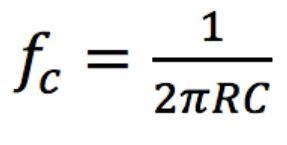{:height="120px" width="120px"}

For the circuit values we used, the cutoff frequency is 6.6kHz.

Our next step was to connect our circuit with the phototransistor and read from the IR hat once more. We were able to consistently detect a usable signal from at least one square away.Here is our output signal with the IR hat one square away from the phototransistor:

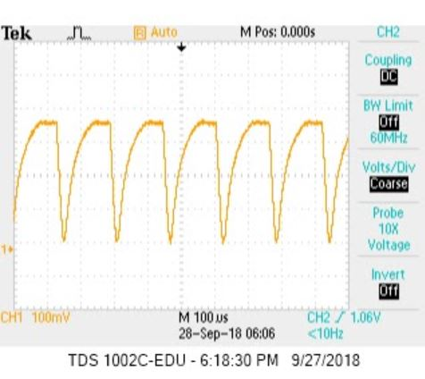{:height="480px" width="640px"}

This is the associated FFT once our circuit has the low pass filter on. The 6kHz frequency has the highest peak while the peaks of the harmonics have decreased a great deal.

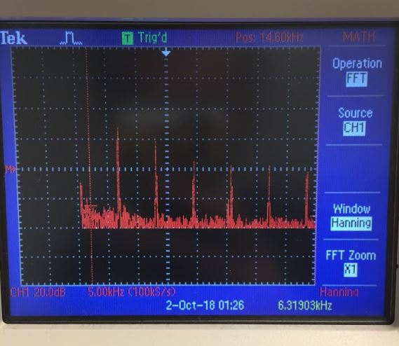{:height="480px" width="640px"}

Looking at the bins for the FFT after we added the low pass filter, we can also see that the peak value of the 6kHz signal is the highest while all other peak values have decreased. The first peak (6kHz) has value of 125, which is the IR frequency emitted by another robot. The second peak (12kHz) has value of 99. The third peak at 18 kHz is the frequency of the decoy. It has value of 57 which is less than half the value of the peak of a real robot. This is a significant difference and will make ignoring decoy robots much easier. 

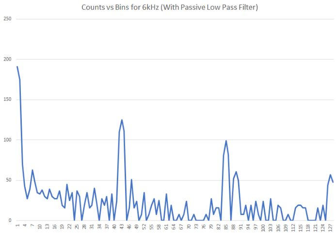{:height="480px" width="640px"}

The code below is used to distinguish between 660Hz and 6kHz signals and what to do given each signal. For the 660Hz signal, the robot starts moving forward since it denotes the start of the maze mapping. If the signal is 6kHz, then the robot does not continue forward. The robot will turn and move out of the way so that it does not collide with another robot.

```cpp
 while(1) { // reduces jitter
    cli();  // UDRE interrupt slows this way down on arduino1.0
    for (int i = 0 ; i < 512 ; i += 2) { // save 256 samples
      while(!(ADCSRA & 0x10)); // wait for adc to be ready
      ADCSRA = 0xf5; // restart adc
      byte m = ADCL; // fetch adc data
      byte j = ADCH;
      int k = (j << 8) | m; // form into an int
      k -= 0x0200; // form into a signed int
      k <<= 6; // form into a 16b signed int
      fft_input[i] = k; // put real data into even bins
      fft_input[i+1] = 0; // set odd bins to 0
    }
    fft_window(); // window the data for better frequency response
    fft_reorder(); // reorder the data before doing the fft
    fft_run(); // process the data in the fft
    fft_mag_log(); // take the output of the fft
    sei();
    if(fft_log_out[5]>120 || fft_log_out[6]>120){//the signal to start has sounded
      moveForward();  
    }
    if(fft_log_out[43]>110){//detects another robot, avert it by turning direction
      moveLeft();
      }
```