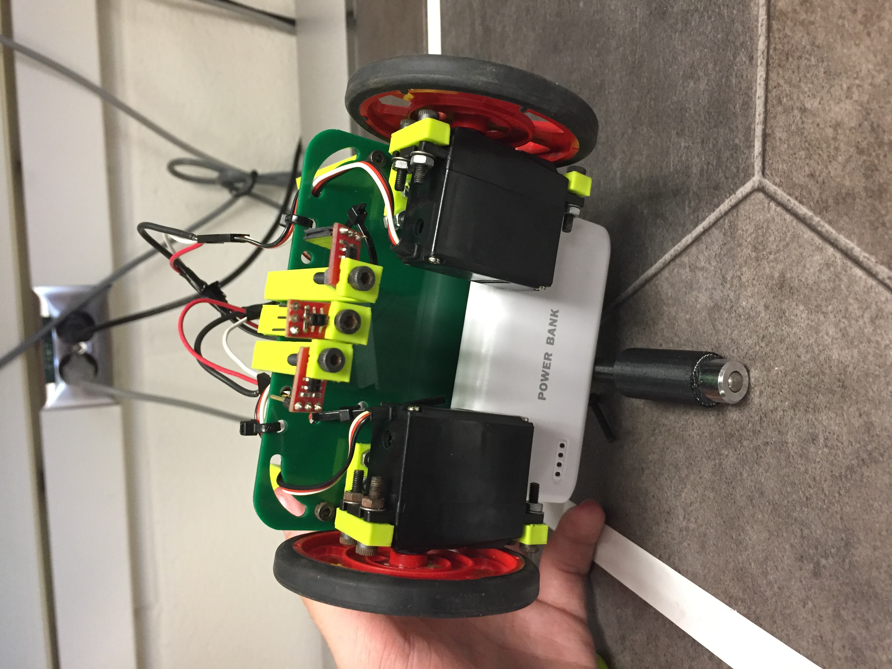

# Milestone 1

## Introduction

To meet Milestone 1, the robot must be able to complete a figure eight. In order to accomplish this goal, the robot must be able to follow a white line and turn at intersections. The main difficulties in this milestone were programming crisp turns. Most of our attention was focused on software this lab.

## Hardware

Our main focus for this milestone was the implementation of our line following sensors. We chose to put three sensors in the front of our robot with the sensors in a line perpendicular to the line they are following. This way, the middle sensor is always over the line being followed while the two outer sensors, which are straddling the line, detect if the robot is straying from the line or if the robot has arrived at an intersection.

The actual sensor setup on the robot is shown below: 
{:height="640px" width="480px"}

Our method for detection of these states is a threshold of the sensor values. We noticed that, while over a white line, the sensors would read a value well below 900 and while over the black mat, the sensors would read at about 1000. Based on this information, we set a threshold at 900. When either side sensor detected a value below this threshold, we knew that our robot was deviating from the line and so this was the robot’s cue to readjust its course. For detecting intersections, we looked for times when all three sensors were reading values below the threshold. This would signal our robot to turn either left or right. As far as which turn the robot should make, this will be handled more effectively when our robot can better detect obstacles as well as map where it has been already.

## Software

### Line Following

The first task is to ensure that our robot can autonomously follow a straight white line. This was done by reading values from the left, middle, and right sensors attached to the robot. Values read off by the various sensors relayed information about where the robot was in relation to the white line. 

For instance, if the middle sensor detects the color white while the left and right sensors do not detect it, then this implies that the robot is centered on the white line and should continue going straight forward with both wheels turning at the same speed. If the right and middle sensors are reading the color white while the left sensor does not, then this implies that the robot is too far to the left and needs to move towards the right to become centered again. To make the robot shift rightwards, we increased the speed of the left wheel compared to that of the right wheel. The same logic follows if the robot is too far to the right and needs to move more towards the left to become centered with the line again. To make the robot shift leftwards, we increased the speed of the right wheel compared to that of the left wheel.

The following code details how we adjusted the robot's wheel speeds to stay on a straight line:

```cpp
//move forward
    if(lsensorR>=threshold && lsensorL>=threshold && lsensorM<threshold){
    servoRight.write(0);
    servoLeft.write(180);
    }
//too far left, move towards the right
    if(lsensorR<threshold && lsensorL>=threshold && lsensorM>=threshold){
    servoRight.write(92);
    servoLeft.write(95);
    delay(10);
    }
//too far right, move towards the left  
    if(lsensorR>=threshold && lsensorL<threshold && lsensorM>=threshold){
    servoRight.write(85);
    servoLeft.write(88);
    delay(10);
    }
```

Whenever the robot passed an intersection, all three sensors would detect the color white. For this specific test case, the robot would continue moving forward. In the figure eight case, the robot would have turned at the intersection.
Below is a video of our robot following a straight line: 
<iframe width="640" height="480" src="https://youtube.com/embed/X39Ky8AKowc" frameborder="0" allowfullscreen></iframe>

### Turning and Figure 8

After the detection of the intersection, we worked on our turning algorithm. The algorithm consists in spinning both wheels in the same direction until the middle sensor is on the white line again, which is defined previously in the line following section. At this point the robot should have completed approximately a 90 degree rotation in whichever direction it was set to rotate, and even if it is not directly on the line, it is capable of resuming line following. 

After the implementation and testing of intersection detection, turning and line following, we implemented a simple algorithm to perform a figure 8 over the grid. 

We start an integer counter using the Arduino millis() function which returns the number of milliseconds since the Arduino began running and increment the counter after every turn, performing four left turns and four right turns. We calibrated the counter based on the estimated time between the turns:
```cpp
counter=(millis()/1000)*.4;
```
The algorithm we used starts by detecting intersections: 
```cpp
if(lsensorR<threshold && lsensorL<threshold && lsensorM<threshold)
```
Then checks based on the counter whether to perform a right or left turn: 
```cpp
if(counter%8<=3){
      delay(50);
      // perform right turn 
      servoRight.write(95);
      servoLeft.write(110);
        }
      else if(counter%8>3){
      delay(50);
      //perform left turn
      servoRight.write(70);
      servoLeft.write(85);
      }
```
We added a 50ms delay before each turn to make sure the robot doesn’t turn too soon. We turn the wheels in the same direction but at different speeds to make sure that the radius of rotation is large enough to avoid overcorrection of the path.

Incrementing the counter after every corresponding turn made it possible to successfully complete the figure 8 as shown below:
<iframe width="640" height="480" src="https://youtube.com/embed/9eWWnboFNME" frameborder="0" allowfullscreen></iframe>

## Conclusion

The robot is capable of completing a figure 8 following the white lines. The robot knew at what intersections to turn left or right because of a counter that incremented every ‘x’ seconds. This counter was only used for the purpose of hardcoding a figure eight path. In the future, the robot will dynamically decide its own path and the counter will be unnecessary. The main goals of the milestone: line following, intersection detection, and turning were accomplished. In the future, we can work on speeding up the turns.
