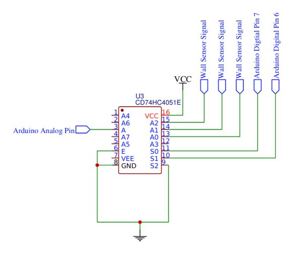

# Milestone 2

## Goal/ Objective

The goal of milestone 2 was to avoid various obstacles in the robot’s way. These included walls and other robots, and it involved integrating our various miniature circuits we had built for previous labs and milestones into one consolidated piece of hardware.

## Wall Detection

To sense the walls, we used short range IR sensors. To test them, we hooked one up to an analog pin of the Arduino and read off the values as we varied the distance of the sensor to the wall. As the sensor got closer to the wall, the value that the Arduino read off increased. We estimated how far the robot would be from a wall and determined a threshold value that determines whether there is a wall present or not.

After empirically learning how the IR sensors functioned, we needed to add a front, left, and right wall sensor to the analog pins of the Arduino. However, the Arduino board only comes with six analog pins, and we needed to use eight analog pins (3 line sensors, 3 wall sensors, 1 IR robot sensor, and 1 microphone). To work around the lack of pins, we used the CD74HC4051E multiplexer. This mux takes in 3 wall sensors and has one analog output, reducing the amount of analog pins we need from 8 to 6. Each of the three wall sensor values will be read sequentially by changing the select pin values on the mux. This way all the values will still be read and stored while using a fewer amount of analog pins.

A pinout of the analog pins on the Arduino is shown below:

{:height="480px" width="640px"}

We added methods to read the values of the front, left, and right wall sensors. The robot only checks for walls at intersections. If a reading on a sensor is above the threshold value, then there is a wall on that side of the robot. Based on the location of walls, the robot behaves in a logical manner to avoid the walls. For instance, if the left and front sensors detect a wall, then the robot should turn right since it is the only non-blocked path.

## Avoiding Other Robots

To successfully avoid other robots, we integrated the free-running FFT function from lab 2 into our main Arduino sketch. However, running the FFT function caused line following and corrections to stop working correctly, because the microprocessor was dealing with the FFT interrupts only and ignoring all other interrupts from the servos. In order to fix this issue, we initialized temporary timer register values to the default as follows:

```cpp
tempADCSRA=ADCSRA;
tempTIMSK0=TIMSK0;
tempADMUX=ADMUX;
tempDIDR0=DIDR0; 
```

These timer register values are overwritten by the FFT function so we reset them at the end of the FFT function to the default values:

```cpp
ADCSRA = tempADCSRA;
TIMSK0 = tempTIMSK0; 
ADMUX = tempADMUX; 
DIDR0 = tempDIDR0;
```

This will stop FFT from continuously overriding the timer register values which could cause interference with any other timer interrupts using the same timers.

This solution significantly improved the concurrent running of the FFT function and the servos. To further optimize it, we decided to temporarily remove the cli() function from FFT, which is responsible for halting all other interrupts during FFT. 

After making sure that concurrent timer interrupts were handled correctly, we proceeded to make the robot stop for 3 seconds when the 6kHz IR hat signal was detected. We successfully accomplished this by looking at the 6kHz bin, and by checking if its magnitude is above a certain threshold.

## LEDs

In order to more accurately display the ‘thinking’ of our robot, we added two LEDs onto it. The green LED  was used to show wall detection. When our robot reached an intersection, it pauses and the LED lights up if the robot determines that it needs to turn to avoid walls. We then added a yellow LED to show robot detection. When a robot was detected, the robot would pause for 3 seconds and the yellow LED would light up, showing that a robot was detected. 

We implemented these LEDs using digital pins. Pins 1 and 2 were used and were declared as output pins. These pins were then set to HIGH when the conditions were met under which the LEDs needed to light up. For example, in the wall detection code, the green LED will have its pin set to HIGH when a wall is detected in front of the robot. After the robot finishes its turn, the pin is then set to LOW and the robot will continue on its path. The same is done for the yellow LED.

Below is a video of our robot following lines, detecting and avoiding walls (green LED lights up), and detecting and stopping when another robot is sensed (yellow LED lights up).

<iframe width="640" height="480" src="https://www.youtube.com/embed/38paRM8Y0Mg" frameborder="0" allowfullscreen></iframe>